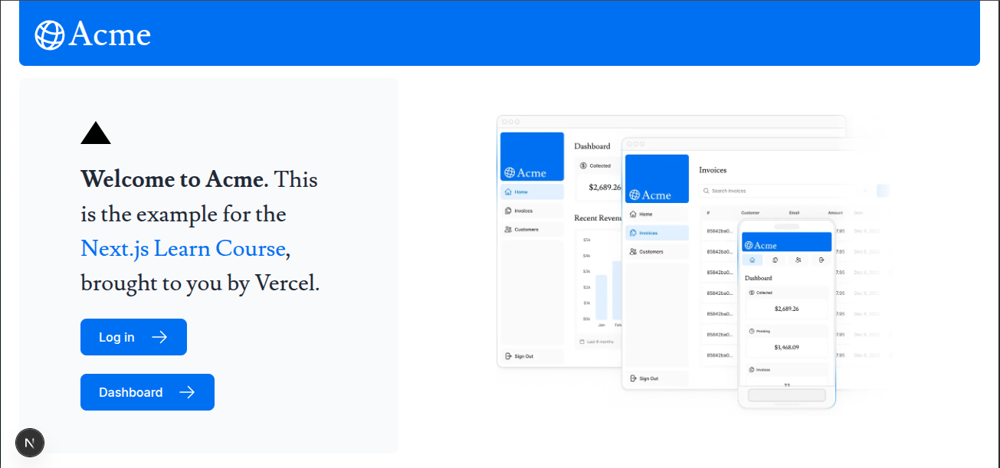

## Next.js App Router Course 

  
This project is the result of me following the official Next.js App Router Tutorial.
I built a full dashboard application step-by-step and used it as a way to understand how modern Next.js works under the hood — including layouts, routing, server components, database integration, and server actions.

It’s not meant to be a production app, but rather a hands-on learning project where I implemented all the main concepts from the tutorial myself.

## 🚀 What I Learned

- App Router Fundamentals
- Server Components & Client Components
- Data Fetching
- Server Actions
- Database Integration
- Authentication

## 🛠 TechStack 

- Next.js (App Router)
- React Server Components
- Tailwind CSS
- PostgreSQL
- NextAuth
- Zod
- TypeScript

## 🧰 How to Run

After cloning:

1. Install dependencies
 ```
pnpm install
```

3. Set environment variables <br />

   Create a ```.env``` file:
```
NEXT_PUBLIC_SUPABASE_ANON_KEY=
NEXT_PUBLIC_SUPABASE_URL=
POSTGRES_DATABASE=
POSTGRES_HOST=
POSTGRES_PASSWORD=
POSTGRES_PRISMA_URL=
POSTGRES_URL=
POSTGRES_URL_NON_POOLING=
POSTGRES_USER=
SUPABASE_ANON_KEY=
SUPABASE_JWT_SECRET=
SUPABASE_SERVICE_ROLE_KEY=
SUPABASE_URL=
AUTH_SECRET=
```
4. Start dev server

```
   pnpm dev
```

6. Seed Initial Data
   
- Navigate to localhost:(Your Port)/seed

## Screenshots


